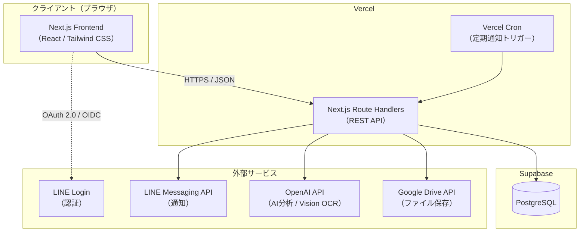
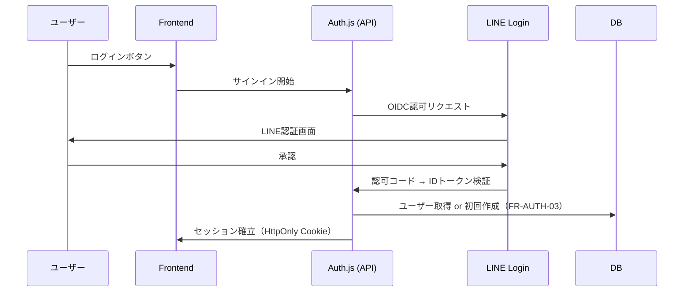
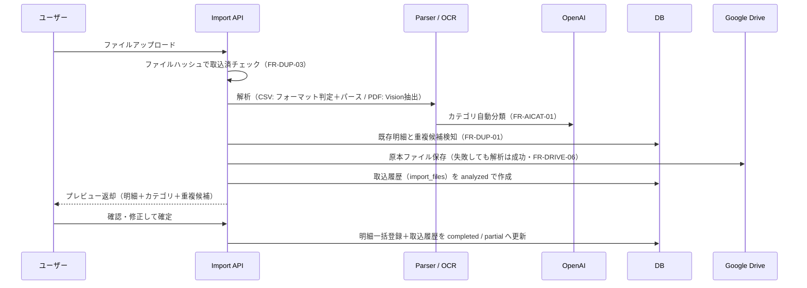

# システム構成書（architecture.md）

Tracking Money のシステム構成・アーキテクチャ設計書です。

要件は docs/requirements.md を正とし、本書は「どう実現するか」を定義します。仕様が競合する場合は requirements.md を優先します。

---

# 1. システム全体構成



## 構成要素と役割

| 構成要素 | 技術 | 役割 |
| --- | --- | --- |
| Frontend | Next.js / TypeScript / Tailwind CSS | 画面表示・ユーザー操作。ビジネスロジックは持たない |
| API | Next.js Route Handlers（REST） | 認証・認可・ビジネスロジック・外部サービス連携の唯一の入口 |
| Database | PostgreSQL（Supabase） | 永続化。RLSでAPI経由以外のアクセスを遮断 |
| 認証 | LINE Login（OIDC） | ユーザー認証 |
| 通知 | LINE Messaging API | リマインド通知の配信 |
| AI / OCR | OpenAI API / OpenAI Vision | AI分析・カテゴリ分類・PDF明細抽出 |
| ファイル保存 | Google Drive API | CSV/PDF原本の保存（アプリ管理の共通Drive） |
| 定期実行 | Vercel Cron | 月次リマインド・未登録検知のトリガー |
| Deploy | Vercel | ホスティング・CI/CD |

---

# 2. 設計原則

CLAUDE.md の方針を上位原則とします。

1. **Feature First Architecture**：コードは技術レイヤーではなく機能（feature）単位で分割する
2. **Clean Architecture を意識**：依存の方向は「UI → アプリケーション → ドメイン ← インフラ」とし、ビジネスロジックを外部技術から独立させる
3. **UI・API・DBの疎結合**：フロントエンドはREST API経由でのみデータへアクセスする。DBスキーマをUIへ直接露出しない
4. **共通処理は Shared へ**：複数featureで使う処理・UI部品・外部クライアントは shared 配下に集約する
5. **ビジネスロジックをUIへ書かない**：判定・計算・整合性チェックはサーバー側のService層に置く

---

# 3. 主要な設計判断（3案比較）

## 3.1 認証方式：LINE Login の統合

| 案 | 内容 | 評価 |
| --- | --- | --- |
| **A. Auth.js（NextAuth）+ LINE Provider（採用）** | Auth.jsのLINEプロバイダでOIDC認証し、セッションをAuth.jsで管理。DBアクセスはサーバー側のみ | ◎ LINE公式プロバイダあり。セッション管理・CSRF対策が組み込み。実績多数 |
| B. Supabase Auth を利用 | Supabase Authの外部プロバイダとして認証 | ✕ Supabase AuthはLINEを標準サポートしておらず、カスタムOIDC統合は複雑で保守リスクが高い |
| C. 自前でOIDC + JWT実装 | LINEのOIDCフローとセッション管理を自作 | ✕ セキュリティ実装（token検証・セッション・CSRF）を自作するリスクと工数が見合わない |

**採用理由**：LINE Loginが要件（FR-AUTH-01）である以上、LINEプロバイダを公式サポートし、セッション管理とCSRF対策が組み込まれたAuth.jsが最も安全かつ保守しやすい。

## 3.2 DBアクセス方式：APIレイヤーの構成

| 案 | 内容 | 評価 |
| --- | --- | --- |
| **A. Route Handlers（REST）+ サーバー側からのみDB接続（採用）** | フロントはREST APIのみ呼び出す。DBアクセスはサーバー側のRepositoryに集約 | ◎ CLAUDE.mdの「REST API」「UI・API・DB疎結合」に合致。認可を一元管理できる |
| B. フロントから supabase-js 直接アクセス | ブラウザからRLS前提でDBへ直接クエリ | ✕ UIとDBが密結合になる。認可ロジックがRLSへ分散し、REST API方針にも反する |
| C. Supabase Edge Functions でAPI構築 | APIをEdge Functionsに実装 | ✕ Next.jsと実装場所が分裂し、型共有・開発体験が悪化。Vercel一体構成のほうがシンプル |

**採用理由**：認可チェック（帳簿単位のアクセス制御）をAPI層のService/Repositoryへ一元化でき、DBスキーマ変更の影響をAPI層で吸収できる。

**RLSの位置づけ**：DBアクセスはサーバー（service roleキー）経由のみとし、RLSは「anonキーによる直接アクセスを全面拒否する」防御層（defense in depth）として機能させる。**業務上の認可（本人・家族メンバーのみ）はAPI層で必ず実施する**（NFR-03）。

## 3.3 定期通知の実行基盤

| 案 | 内容 | 評価 |
| --- | --- | --- |
| **A. Vercel Cron（採用）** | vercel.json でスケジュール定義し、通知用Route Handlerを起動 | ◎ 追加インフラ不要。コードと同一リポジトリで管理できる |
| B. Supabase pg_cron + Edge Functions | DB側のcronからEdge Functionを起動 | △ 実現可能だが実装場所が分裂する（3.2と同じ理由） |
| C. GitHub Actions の schedule | ActionsからAPIを叩く | ✕ アプリ外に運用要素が増え、シークレット管理も分散する |

**採用理由**：構成要素を増やさず、通知ロジックをアプリ本体と同じコード・デプロイで管理できる。Cronエンドポイントは `CRON_SECRET` による認証で保護する。

## 3.4 按分・精算（FR-SPLIT）のデータモデル

家族家計簿限定の按分・精算機能（database.md 3.3 / 3.6）に関する3つの設計判断。

### (a) 按分情報の保持方法

| 案 | 内容 | 評価 |
| --- | --- | --- |
| **A. entries へ列を追加（採用）** | `paid_by_user_id` / `split_type` / `split_shares`(jsonb) / `assigned_user_id` を entries に直接持つ | ◎ 家族家計簿は少人数（数名）を想定し行数が増えない。既存の集計方針（後述 (c)）と親和性が高く、JOINが不要でシンプル |
| B. 明細×メンバーの子テーブル（entry_shares） | 明細ごとに各メンバーの按分行を1行ずつ保持 | ✕ 大半（既定比重）のケースで冗長な行が発生する。取込時（CSVインポート）に毎回複数行を生成する必要があり実装が複雑化する |
| C. 按分情報を独立したJSONB管理テーブルに集約 | entries とは別テーブルで按分設定のみ管理 | ✕ 明細本体と按分情報が分離し、明細編集時の同時更新漏れ・整合性管理のリスクが増える |

### (b) 比重の表現方法

| 案 | 内容 | 評価 |
| --- | --- | --- |
| **A. 正の重み（weight）を正規化して計算（採用）** | `ledger_members.expense_weight`（整数・例：60/40）を合計に対する比率へ都度正規化 | ◎ メンバー増減時に他メンバーの値を再配分する必要がない。DB制約もシンプル（`> 0` のみ） |
| B. パーセンテージ（合計100を強制） | 0-100の整数を保持し、家計簿内合計が100になることをDBで保証 | ✕ 複数行にまたがる「合計100」制約はトリガー等が必要で複雑。メンバー追加・脱退のたびに既存メンバーの再配分が発生しUXが悪い |
| C. 明細ごとに実額を直接指定 | 比率ではなく円単位の負担額を都度入力 | ✕ 「既定比重で自動按分」（FR-SPLIT-03既定値）という要件を満たせない。毎回入力が必須になる |

### (c) 精算計算のタイミング

| 案 | 内容 | 評価 |
| --- | --- | --- |
| **A. 都度計算・キャッシュなし（採用）** | 精算APIの呼び出しごとに対象月の entries をJS純粋関数で集計する（analysisService/aggregation.ts と同方針） | ◎ ユーザー確認済み（精算完了の記録・履歴は不要）。データ不整合が起きず実装が最小 |
| B. 月次スナップショットを保存 | 精算実行時点の結果をテーブルへ保存し履歴として残す | ✕ 精算完了記録は不要と確認済み。新規テーブル・状態管理が増える |
| C. analysis_caches と同様の入力ハッシュ付きキャッシュ | 明細変更を検知して再生成 | ✕ 精算はダッシュボード等より参照頻度が低く、キャッシュの恩恵よりNFR-13対象外（AI呼び出しを伴わない）の複雑性増加が上回る |

**共通の前提**：既定比重（`ledger_members.expense_weight`）を変更しても、過去に登録済みの明細（`split_type = 'default'`）の按分計算は明細ごとに固定保存されず、精算計算を実行した時点の最新の既定比重を常に適用する（FR-SPLIT-06）。

---

# 4. レイヤー構成

Feature First を前提に、各feature内部を以下のレイヤーで構成します。

```text
[Client]
  Components / Hooks        … 表示・入力・状態管理（ビジネスロジック禁止）
      │  fetch (REST / JSON)
      ▼
[Server]
  Route Handler（app/api/…）… リクエスト検証・認証確認・HTTPステータス変換のみ
      ▼
  Service                   … ビジネスロジック・認可チェック・トランザクション制御
      ▼
  Repository                … DBアクセス（Supabase）。SQLの詳細を隠蔽
      ▼
  External Client（shared） … OpenAI / LINE / Google Drive のAPIクライアント
```

## レイヤー責務ルール

| レイヤー | してよいこと | してはいけないこと |
| --- | --- | --- |
| Component / Hook | 表示、入力検証（UX目的）、API呼び出し | ビジネスロジック、DB・外部サービス直接アクセス |
| Route Handler | 認証確認、入力パース（zod等）、Service呼び出し、HTTPステータス決定 | ビジネスロジック、SQL |
| Service | 認可チェック、業務ルール、複数Repositoryの組み合わせ | HTTPの知識（Request/Response型への依存） |
| Repository | クエリ実行、DB行⇔ドメイン型の変換 | 業務判断、認可チェック |
| External Client | 外部APIの呼び出しとエラー変換 | 業務判断 |

---

# 5. ディレクトリ構成

```text
tracking-money/
├── frontend/                        # Next.js アプリケーション
│   ├── src/
│   │   ├── app/                     # App Router（ルーティングのみ・薄く保つ）
│   │   │   ├── (auth)/              # ログイン画面
│   │   │   ├── (main)/              # 認証後の画面（dashboard, entries, import, …）
│   │   │   └── api/                 # Route Handlers（REST API）
│   │   ├── features/                # Feature First 本体
│   │   │   ├── auth/                # 認証・アカウント
│   │   │   ├── ledger/              # 家計簿・家族招待
│   │   │   ├── entry/               # 明細CRUD
│   │   │   ├── category/            # カテゴリ管理
│   │   │   ├── import/              # CSV/PDF取込・重複チェック
│   │   │   ├── analysis/            # AI分析・ダッシュボード
│   │   │   └── notification/        # LINE通知設定
│   │   │   # 各feature内: components/ hooks/ services/ repositories/ types/
│   │   └── shared/
│   │       ├── components/          # 共通UI（Button, Table, Card, …）
│   │       ├── hooks/
│   │       ├── lib/                 # supabase / openai / line / google-drive クライアント
│   │       ├── config/              # 環境変数の検証・定数
│   │       ├── types/
│   │       └── utils/
│   └── （next.config.ts, tailwind.config.ts, package.json 等）
├── backend/                         # Supabase プロジェクト
│   └── supabase/
│       ├── migrations/              # DBマイグレーション（スキーマ変更はここで管理）
│       ├── seed.sql                 # デフォルトカテゴリ等の初期データ
│       └── config.toml
├── docs/                            # 設計ドキュメント
└── .github/                         # CI（lint / typecheck / test / build）
```

* feature間の直接import は禁止。共有が必要になったら shared へ昇格させる
* `app/` はルーティングとレイアウトのみとし、実装は `features/` へ委譲する

---

# 6. 認証・認可フロー

## 6.1 認証（ログイン）



## 6.2 認可（リクエストごと）

1. Route Handler がセッションを検証（未認証は 401）
2. Service が対象リソースの帳簿IDを解決し、「ログインユーザーがその帳簿のオーナーまたは参加メンバーか」を検証（違反は 403）
3. 個人家計簿は本人のみ、家族家計簿はメンバーのみ許可（FR-LEDGER-03 / 04）

認可チェックはServiceの共通関数（例：`assertLedgerAccess(userId, ledgerId)`）に集約し、全Serviceで必ず経由させる。

---

# 7. 主要データフロー

## 7.1 CSV/PDFインポート（Phase 2）



Drive保存と取込履歴の作成は**解析（analyze）時点**で行う（api.md 7.1）。プレビュー離脱で確定されなかったファイルも履歴に残り、再取込時の取込済み警告（FR-DUP-03）の対象にできる。

設計ポイント：

* パーサーはカード会社ごとに独立したモジュール（共通インターフェース `StatementParser` を実装）とし、フォーマット変更の影響を局所化する
* 「解析→プレビュー」と「確定→登録」は別APIとし、無確認登録を構造的に防ぐ（FR-CSV-04 / FR-PDF-02）
* OCR・AI分類の失敗は取込全体を失敗させない（FR-PDF-03 / FR-AICAT-04）

## 7.2 AI分析（Phase 3）

1. API が DB から対象期間の明細を集計（SQL集計を基本とし、明細全件をAIへ渡さない）
2. 集計結果をOpenAI APIへ渡し、構造化出力（JSON Schema指定）で所見・提案を取得
3. 分析結果はDBへキャッシュし、同一条件の再リクエストではAPIを呼ばない（NFR-13）
4. AI失敗時は集計・グラフのみ表示し、所見欄はエラー表示（FR-AI-11）

## 7.3 定期通知（Phase 3）

1. Vercel Cron が通知用エンドポイントを日次で起動（`CRON_SECRET` で認証）
2. 「本日が通知設定日のユーザー」（FR-NOTIFY-01）と「最終登録からN日経過したユーザー」（FR-NOTIFY-02）を抽出
3. LINE Messaging API でプッシュ通知。失敗はログ記録のみでリトライは次回実行に委ねる（FR-NOTIFY-04）

---

# 8. 外部サービス連携方針

| サービス | 接続方法 | 障害時の振る舞い |
| --- | --- | --- |
| LINE Login | Auth.js LINEプロバイダ（OIDC） | ログイン不可（アプリ全体が利用不可。エラーページで案内） |
| LINE Messaging API | サーバーからPush API呼び出し | 通知スキップ・ログ記録（本体機能へ影響なし） |
| OpenAI API | サーバーからのみ呼び出し（APIキーはサーバー環境変数） | AI機能のみ縮退。記録・集計は正常動作（FR-AI-11） |
| Google Drive API | サービスアカウントでアプリ管理Driveへ接続 | ファイル保存のみ失敗扱い。明細取込は成功（FR-DRIVE-06） |

共通ルール：

* 外部APIキーは絶対にクライアントへ渡さない（`NEXT_PUBLIC_` を付けない）
* 外部クライアントは `shared/lib/` に集約し、タイムアウト・エラー変換を統一する
* 外部呼び出しのログにはリクエスト内容（明細・個人情報）を含めない（NFR-05）

---

# 9. 環境構成

## 9.1 環境一覧

| 環境 | Frontend | DB | 用途 |
| --- | --- | --- | --- |
| ローカル開発 | `npm run dev` | Supabase CLI（Docker） | 開発・テスト |
| 本番 | Vercel | Supabase（クラウド） | 実利用 |

* DBスキーマは `backend/supabase/migrations/` のマイグレーションのみで変更する（手動変更禁止）
* CI（GitHub Actions）で lint / typecheck / test / build を実行し、mainマージでVercelへデプロイする

## 9.2 環境変数

| 変数 | 用途 | 公開範囲 |
| --- | --- | --- |
| `NEXT_PUBLIC_SUPABASE_URL` | Supabase接続先 | クライアント可 |
| `NEXT_PUBLIC_SUPABASE_ANON_KEY` | anonキー（RLSで全拒否・実質未使用の防御層） | クライアント可 |
| `SUPABASE_SERVICE_ROLE_KEY` | サーバーからのDBアクセス | **サーバーのみ** |
| `AUTH_SECRET` | Auth.jsセッション署名 | **サーバーのみ** |
| `LINE_CHANNEL_ID` / `LINE_CHANNEL_SECRET` | LINE Login | **サーバーのみ** |
| `LINE_MESSAGING_CHANNEL_ACCESS_TOKEN` | LINE通知（Loginとは別チャネル・CON-04） | **サーバーのみ** |
| `OPENAI_API_KEY` | AI分析・OCR | **サーバーのみ** |
| `GOOGLE_SERVICE_ACCOUNT_KEY` | Drive接続（サービスアカウント・CON-05） | **サーバーのみ** |
| `CRON_SECRET` | Cronエンドポイント保護 | **サーバーのみ** |

環境変数は `shared/config/` で起動時に検証（zod）し、欠落時は明確なエラーで停止する。

---

# 10. 横断的関心事

## 10.1 エラーハンドリング

* Service層は業務エラーを型付きエラー（例：`AppError` のサブタイプ）で表現し、Route Handlerが対応するHTTPステータス（400/401/403/404/409/500）へ変換する
* フロントは共通のエラー表示コンポーネントでユーザー向けメッセージを表示する（エラーを握りつぶさない）
* ログは原因調査に必要な情報（エラー種別・対象ID・スタック）のみ記録し、明細内容・個人情報は含めない

## 10.2 パフォーマンス

* 一覧系APIはページング必須（api.md で定義）
* 集計はSQLで行い、アプリ側での全件ループを避ける（NFR-02）
* React Server Components を基本とし、クライアントコンポーネントは必要な箇所へ限定する

## 10.3 テスト戦略

| 対象 | 種別 | 方針 |
| --- | --- | --- |
| Service / Parser / Utils | Unit Test | 外部依存をモックし、業務ロジック・パース処理を網羅 |
| Route Handler + DB | Integration Test | ローカルSupabaseに対して認可・CRUD・重複チェックを検証 |
| 主要フロー（ログイン〜明細登録〜取込） | E2E Test | 必要に応じてPlaywrightで作成 |

外部AI・LINE・DriveはテストではすべてモックとしAPI課金を発生させない。

---

# 11. 拡張性の考慮（Phase 4への備え）

| 将来機能 | 現時点で行う備え |
| --- | --- |
| 銀行・証券・電子マネー連携 | 明細に「取込元（source）」を持たせ、取込経路の追加をパーサー／コネクタの追加で実現できる構造にする |
| 資産管理・収入管理 | 明細テーブルを支出専用に固定せず、種別（type）拡張が可能な設計とする（database.md で定義） |
| 予算管理 | カテゴリ集計をServiceとして独立させ、予算比較から再利用できるようにする |
| レシート撮影 | OCR処理を「入力（PDF/画像）→明細候補」の共通インターフェースに抽象化しておく |
| PWA対応 | 特別な備えは不要（Next.jsの標準的な対応で追加可能） |

---

# 改訂履歴

| 日付 | 内容 |
| --- | --- |
| 2026-07-04 | 初版作成 |
| 2026-07-05 | レビュー指摘反映：7.1 シーケンス図の Drive保存・取込履歴作成タイミングを api.md 7.1（analyze時）と整合 |
| 2026-07-21 | 3.4 按分・精算（FR-SPLIT）のデータモデル設計判断を追加・実装（entries列追加方式・重み正規化方式・都度計算方式を採用） |
