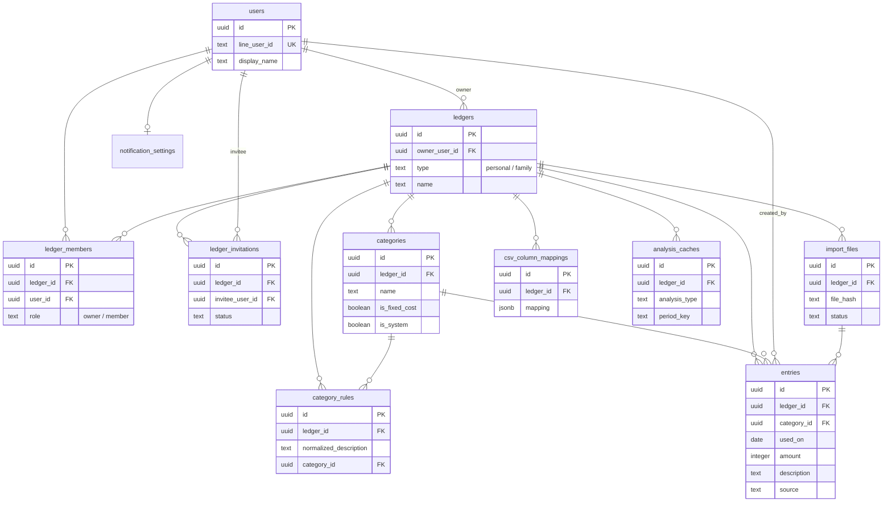

# テーブル定義書（database.md）

Tracking Money のデータベース設計書です。

要件は docs/requirements.md、構成方針は docs/architecture.md を正とします。

スキーマ変更は必ず本書を更新し、`backend/supabase/migrations/` のマイグレーションとして適用します（DBへの手動変更は禁止）。

---

# 1. 共通ルール

## 1.1 共通カラム

全テーブル（明示した例外を除く）に以下を必須とします。

| カラム | 型 | 内容 |
| --- | --- | --- |
| id | uuid | 主キー。`gen_random_uuid()` |
| created_at | timestamptz | 作成日時。`now()` |
| updated_at | timestamptz | 更新日時。トリガーで自動更新 |
| deleted_at | timestamptz | 論理削除日時。NULL = 有効 |

## 1.2 設計規約

* 命名は snake_case。テーブル名は複数形
* 外部キーには必ずFK制約を付与する。参照先の物理削除は行わない前提のため `ON DELETE RESTRICT` を基本とする
* 論理削除済みデータは通常のクエリで必ず除外する（`deleted_at IS NULL`）
* 一意制約は論理削除と両立させるため **部分ユニークインデックス**（`WHERE deleted_at IS NULL`）で実現する
* 区分値（type / status 等）はPostgreSQLのenum型ではなく **text + CHECK制約** とする（enum型は値追加時のマイグレーション負担が大きいため）
* 金額は日本円の整数（`integer`）。**返金・返品明細を扱うため負値を許容する**
* タイムゾーンは `timestamptz` で保持し、表示時に Asia/Tokyo へ変換する（CON-03）

## 1.3 RLS（Row Level Security）

architecture.md 3.2 の方針に従います。

* 全テーブルでRLSを有効化し、**anonロールのポリシーは作成しない**（＝anonキーからの直接アクセスを全面拒否）
* DBアクセスはサーバー（service role）経由のみ。業務上の認可（帳簿メンバー判定）はAPI層で実施する

---

# 2. ER図



---

# 3. テーブル定義

共通カラム（id / created_at / updated_at / deleted_at）は記載を省略します。

## 3.1 users（ユーザー）

LINE Loginで認証されたユーザー（FR-AUTH-03）。

| カラム | 型 | NULL | 内容 |
| --- | --- | --- | --- |
| line_user_id | text | NOT NULL | LINEのユーザーID（OIDC sub）。ログイン照合に使用 |
| display_name | text | NOT NULL | 表示名（初期値はLINE表示名・変更可） |
| avatar_url | text | NULL | アイコンURL |

制約・Index

| 種別 | 定義 |
| --- | --- |
| UNIQUE | (line_user_id) WHERE deleted_at IS NULL |

## 3.2 ledgers（家計簿）

個人家計簿・家族家計簿（FR-LEDGER-01〜02）。

| カラム | 型 | NULL | 内容 |
| --- | --- | --- | --- |
| owner_user_id | uuid | NOT NULL | 作成者。FK → users.id |
| type | text | NOT NULL | `personal` / `family`。CHECK制約 |
| name | text | NOT NULL | 家計簿名 |
| drive_folder_id | text | NULL | 取込原本を保存するGoogle Driveフォルダ（家計簿単位で分離・FR-DRIVE-02）。初回インポート時に作成してIDを保存する（作成前・Drive未使用の間はNULL） |

制約・Index

| 種別 | 定義 |
| --- | --- |
| UNIQUE | (owner_user_id, type) WHERE deleted_at IS NULL（個人1つ・家族1つを保証） |
| CHECK | type IN ('personal', 'family') |

## 3.3 ledger_members（家計簿メンバー）

家計簿へのアクセス権を持つユーザー。**個人・家族を問わず、家計簿作成時に必ずオーナー行を作成する**（認可チェックを本テーブルへの1クエリに統一するため）。

| カラム | 型 | NULL | 内容 |
| --- | --- | --- | --- |
| ledger_id | uuid | NOT NULL | FK → ledgers.id |
| user_id | uuid | NOT NULL | FK → users.id |
| role | text | NOT NULL | `owner` / `member`。CHECK制約 |

制約・Index

| 種別 | 定義 |
| --- | --- |
| UNIQUE | (ledger_id, user_id) WHERE deleted_at IS NULL |
| INDEX | (user_id) WHERE deleted_at IS NULL（自分の所属帳簿の取得用） |

アプリ層で担保するルール（DB制約では表現しない）

* 個人家計簿のメンバーはオーナー1名のみ（FR-LEDGER-03）
* 1ユーザーが所属できる家族家計簿は最大1つ（FR-LEDGER-05）。招待承諾時にServiceで検証する

## 3.4 ledger_invitations（家族招待）

家族家計簿への招待（FR-INVITE-01〜03）。

| カラム | 型 | NULL | 内容 |
| --- | --- | --- | --- |
| ledger_id | uuid | NOT NULL | 招待先の家族家計簿。FK → ledgers.id |
| inviter_user_id | uuid | NOT NULL | 招待した人。FK → users.id |
| invitee_user_id | uuid | NOT NULL | 招待された人。FK → users.id |
| status | text | NOT NULL | `pending` / `accepted` / `declined` / `canceled`。CHECK制約 |
| responded_at | timestamptz | NULL | 承諾・拒否した日時 |

制約・Index

| 種別 | 定義 |
| --- | --- |
| UNIQUE | (ledger_id, invitee_user_id) WHERE status = 'pending' AND deleted_at IS NULL（同一相手への重複招待防止） |
| INDEX | (invitee_user_id, status) WHERE deleted_at IS NULL（自分宛の招待一覧用） |

## 3.5 categories（カテゴリ）

家計簿ごとのカテゴリ（FR-CATEGORY-01〜04）。

| カラム | 型 | NULL | 内容 |
| --- | --- | --- | --- |
| ledger_id | uuid | NOT NULL | FK → ledgers.id |
| name | text | NOT NULL | カテゴリ名 |
| is_fixed_cost | boolean | NOT NULL default false | 固定費フラグ（FR-CATEGORY-04） |
| is_system | boolean | NOT NULL default false | システムカテゴリ（「その他」）。削除不可・カテゴリ付け替え先（FR-CATEGORY-03） |
| sort_order | integer | NOT NULL | 表示順 |

制約・Index

| 種別 | 定義 |
| --- | --- |
| UNIQUE | (ledger_id, name) WHERE deleted_at IS NULL |
| INDEX | (ledger_id, sort_order) WHERE deleted_at IS NULL |

家計簿作成時にデフォルトカテゴリ一式を投入する（FR-CATEGORY-02。一覧は seed 定義を正とする）。

## 3.6 entries（明細）

支出明細（FR-ENTRY-01〜07）。本アプリの中心テーブル。

| カラム | 型 | NULL | 内容 |
| --- | --- | --- | --- |
| ledger_id | uuid | NOT NULL | FK → ledgers.id |
| category_id | uuid | NOT NULL | FK → categories.id |
| used_on | date | NOT NULL | 利用日 |
| billing_month | text | NOT NULL | 支払月（YYYY-MM）。カード請求の対象月。利用日と異なる場合がある（例：6/23利用が7月請求）。一覧の絞り込み・分析集計の基準はこちら（利用日ではない） |
| amount | integer | NOT NULL | 金額（円・整数）。返金は負値 |
| description | text | NOT NULL | 摘要（店名等） |
| normalized_description | text | NOT NULL | 正規化済み摘要（全半角統一・空白除去等）。重複チェック・カテゴリ学習に使用 |
| payment_method | text | NULL | 支払方法（自由入力） |
| memo | text | NULL | メモ |
| type | text | NOT NULL default 'expense' | 明細種別。Phase 1〜3 は `expense` のみ（将来の収入対応用・CHECK制約） |
| source | text | NOT NULL | 取込元 `manual` / `csv` / `pdf`（FR-ENTRY-06。CHECK制約） |
| import_file_id | uuid | NULL | 取込ファイル。FK → import_files.id（手入力はNULL） |
| created_by_user_id | uuid | NOT NULL | 登録者。FK → users.id（FR-ENTRY-05） |

制約・Index

| 種別 | 定義 |
| --- | --- |
| INDEX | (ledger_id, used_on DESC) WHERE deleted_at IS NULL（利用日の期間絞込・重複チェック用） |
| INDEX | (ledger_id, billing_month) WHERE deleted_at IS NULL（支払月の一覧絞込・分析集計用。既定の絞り込み軸） |
| INDEX | (ledger_id, category_id, used_on) WHERE deleted_at IS NULL（カテゴリ別集計用） |
| INDEX | (ledger_id, used_on, amount, normalized_description) WHERE deleted_at IS NULL（重複チェック用・FR-DUP-01） |
| CHECK | source IN ('manual', 'csv', 'pdf') |
| CHECK | type IN ('expense') ※将来 `income` 等を追加 |
| CHECK | billing_month ~ '^\d{4}-(0[1-9]\|1[0-2])$' |

## 3.7 import_files（取込履歴）

CSV/PDF取込の履歴とDrive保存状態（FR-CSV-05 / FR-DRIVE-01〜06 / FR-DUP-03）。

| カラム | 型 | NULL | 内容 |
| --- | --- | --- | --- |
| ledger_id | uuid | NOT NULL | FK → ledgers.id |
| uploaded_by_user_id | uuid | NOT NULL | FK → users.id |
| file_name | text | NOT NULL | 元ファイル名 |
| file_type | text | NOT NULL | `csv` / `pdf`。CHECK制約 |
| file_hash | text | NOT NULL | ファイル内容のSHA-256。取込済み警告に使用 |
| format | text | NOT NULL | `rakuten` / `jcb` / `epos` / `saison` / `generic` / `pdf`。CHECK制約 |
| billing_month | text | NOT NULL | 取込時に指定した支払月（YYYY-MM）。取込全体（＝1回の請求書）の既定値。行ごとの実際の支払月は entries.billing_month が正 |
| status | text | NOT NULL | `analyzed`（解析済・確定待ち） / `completed` / `partial` / `failed`。CHECK制約 |
| imported_count | integer | NOT NULL default 0 | 取込件数 |
| skipped_count | integer | NOT NULL default 0 | スキップ件数（重複等） |
| error_count | integer | NOT NULL default 0 | エラー件数 |
| error_detail | jsonb | NULL | エラー行の詳細（個人情報は最小限に） |
| drive_file_id | text | NULL | Google DriveファイルID |
| drive_web_view_link | text | NULL | Driveリンク（FR-DRIVE-05） |
| drive_status | text | NOT NULL | `uploaded` / `failed`。CHECK制約（FR-DRIVE-06） |

制約・Index

| 種別 | 定義 |
| --- | --- |
| INDEX | (ledger_id, file_hash) WHERE deleted_at IS NULL（同一ファイル警告用。強制取込を許すためUNIQUEにしない） |
| INDEX | (ledger_id, created_at DESC) WHERE deleted_at IS NULL（取込履歴一覧用） |
| CHECK | billing_month ~ '^\d{4}-(0[1-9]\|1[0-2])$' |

## 3.8 csv_column_mappings（汎用CSV列マッピング）

汎用（列マッピング）方式の保存済み定義（FR-CSV-02）。

| カラム | 型 | NULL | 内容 |
| --- | --- | --- | --- |
| ledger_id | uuid | NOT NULL | FK → ledgers.id |
| name | text | NOT NULL | マッピング名（例：「◯◯カード用」） |
| mapping | jsonb | NOT NULL | 列対応定義（利用日・金額・摘要の列番号、日付形式、ヘッダー行数等） |

制約・Index

| 種別 | 定義 |
| --- | --- |
| UNIQUE | (ledger_id, name) WHERE deleted_at IS NULL |

`mapping` のスキーマはアプリ側で zod により検証する（例）：

```json
{
  "headerRows": 1,
  "usedOnColumn": 0,
  "usedOnFormat": "YYYY/MM/DD",
  "descriptionColumn": 1,
  "amountColumn": 4
}
```

## 3.9 category_rules（カテゴリ学習ルール）

ユーザーが修正した「摘要→カテゴリ」の対応（FR-AICAT-03）。取込時にAI判定より優先する。

| カラム | 型 | NULL | 内容 |
| --- | --- | --- | --- |
| ledger_id | uuid | NOT NULL | FK → ledgers.id |
| normalized_description | text | NOT NULL | 正規化済み摘要 |
| category_id | uuid | NOT NULL | FK → categories.id |

制約・Index

| 種別 | 定義 |
| --- | --- |
| UNIQUE | (ledger_id, normalized_description) WHERE deleted_at IS NULL |

## 3.10 notification_settings（通知設定）

ユーザーごとのLINE通知設定（FR-NOTIFY-01〜03）。ユーザー作成時に既定値で自動作成する。

| カラム | 型 | NULL | 内容 |
| --- | --- | --- | --- |
| user_id | uuid | NOT NULL | FK → users.id |
| monthly_enabled | boolean | NOT NULL default true | 月次定期リマインドON/OFF |
| monthly_day | smallint | NOT NULL default 1 | 通知日（1〜31。存在しない日は月末へ繰上げ） |
| monthly_last_sent_on | date | NULL | 月次通知の最終送信日（重複送信防止） |
| inactivity_enabled | boolean | NOT NULL default true | 未登録検知リマインドON/OFF |
| inactivity_days | smallint | NOT NULL default 7 | 未登録とみなす日数 |
| inactivity_last_sent_at | timestamptz | NULL | 未登録通知の最終送信日時（連投防止） |

制約・Index

| 種別 | 定義 |
| --- | --- |
| UNIQUE | (user_id) WHERE deleted_at IS NULL |
| CHECK | monthly_day BETWEEN 1 AND 31 |
| CHECK | inactivity_days BETWEEN 1 AND 90 |

## 3.11 analysis_caches（AI分析キャッシュ）

AI分析結果のキャッシュ（NFR-13）。**派生データのため論理削除は行わず、物理削除（上書き・破棄）を許可する**（共通ルールの例外）。

| カラム | 型 | NULL | 内容 |
| --- | --- | --- | --- |
| ledger_id | uuid | NOT NULL | FK → ledgers.id |
| analysis_type | text | NOT NULL | 分析種別。値は api.md 9.6 の `type` と一致させる（`monthly_review` / `fixed_cost` / `saving_advice` / `forecast`） |
| period_key | text | NOT NULL | 対象期間キー（例：`2026-07`） |
| input_hash | text | NOT NULL | 集計入力のハッシュ。明細が変わればキャッシュ不一致となり再生成 |
| result | jsonb | NOT NULL | AI出力（構造化JSON） |

制約・Index

| 種別 | 定義 |
| --- | --- |
| UNIQUE | (ledger_id, analysis_type, period_key) |

---

# 4. 認可クエリの基本形

API層の認可チェック（architecture.md 6.2）は本設計により1クエリで行えます。

```sql
-- ログインユーザーが対象帳簿へアクセスできるか
SELECT 1
FROM ledger_members
WHERE ledger_id = $1
  AND user_id = $2
  AND deleted_at IS NULL;
```

---

# 5. 初期データ（seed）

家計簿作成時にアプリ（Service層）が投入するデフォルトカテゴリ：

食費 / 日用品 / 交通費 / 住居 / 水道光熱費 / 通信費 / 保険 / 医療 / 教育 / 娯楽 / 被服 / 交際費 / サブスク / その他（is_system = true）

* 「水道光熱費・通信費・保険・住居」は is_fixed_cost = true を初期値とする
* 一覧の最終確定は Phase 1 実装時にユーザーへ提示して行う（requirements.md 未確定事項）

家計簿作成（ledgers ＋ オーナー ledger_members ＋ 上記カテゴリ）は原子性が必要なため、
RPC 関数 `create_ledger_with_defaults(p_owner_user_id, p_type, p_name, p_categories jsonb)` に
まとめて単一トランザクションで実行する（マイグレーション `20260706000200`）。カテゴリ内容は
アプリの `buildDefaultCategories()` が生成して jsonb で渡す。

家計簿の論理削除（FR-LEDGER-08）も原子性が必要なため、RPC 関数
`delete_ledger_cascade(p_ledger_id uuid)` で家計簿本体と Phase 1 子データ
（ledger_members・categories・entries・ledger_invitations）を単一トランザクションで
論理削除する（マイグレーション `20260706000300`）。ledger_members を同時に論理削除しないと
§4 の認可クエリでアクセス権が残り続けるため、必ず含める。オーナー認可・存在確認は Service 層で
事前に行う。Phase 2/3 のテーブル追加時はこの関数へ削除対象を追記する。

カテゴリ管理（FR-CATEGORY・マイグレーション `20260706000400`）も原子性が必要な操作を RPC で行う。

* `delete_category_with_reassign(p_ledger_id, p_category_id, p_reassign_to)`：使用中明細を
  付け替え先へ移してからカテゴリを論理削除する（明細のカテゴリ欠損防止・FR-CATEGORY-03）。
* `reorder_categories(p_ledger_id, p_category_ids uuid[])`：配列順に sort_order を 0 始まりで再設定
  （`unnest ... with ordinality` の単一 UPDATE・空配列は no-op・マイグレーション `20260710000200`）。

いずれも `is_system` 保護・付け替え先/全件一致の検証・認可は Service 層で事前に行い、RPC は
データ操作に専念する。WHERE の `ledger_id` 一致で他帳簿への波及を防ぐ。

家族招待の承諾（FR-INVITE-02/03・マイグレーション `20260706000500`）も原子性が必要なため
RPC で行う。

* `accept_family_invitation(p_invitation_id, p_invitee_user_id, p_own_family_ledger_id)`：
  （任意）承諾者が所有する家族家計簿を `delete_ledger_cascade` で論理削除 →
  招待先へ `ledger_members`(member) を追加 → 招待を accepted 更新、を単一トランザクションで実行し、
  更新後の招待行を返す（returns ledger_invitations・マイグレーション `20260710000300`）。
  承諾可否（本人・pending・所属制約 FR-LEDGER-05）は Service が事前検証し、削除対象の自帳簿 id
  を渡す（削除しない場合は NULL）。

家族家計簿の二重所属（FR-LEDGER-05）は Service の事前検証だけでは同時実行で防げないため、
DB側のバックストップとしてガード関数 `assert_no_family_membership(p_user_id)`
（マイグレーション `20260710000100`）を置く。ユーザー単位の `pg_advisory_xact_lock` で
家族所属の書き込みを直列化し、有効な家族所属が既に存在すれば SQLSTATE `FML01` で失敗させる。
呼び出し箇所は `accept_family_invitation`（自帳簿削除後・メンバー挿入前）と
`create_ledger_with_defaults`（`p_type = 'family'` 時のみ）。アプリは `FML01` を
409 Conflict へ変換する。

---

# 6. マイグレーション運用

1. スキーマ変更は本書の更新を先に行い、ユーザーの承認を得る（CLAUDE.md「DBスキーマ変更前には必ず提案」）
2. `supabase migration new <name>` でマイグレーションを作成する
3. ローカル（Supabase CLI）で適用・テスト後、本番へ適用する
4. マイグレーションは後方互換を意識し、破壊的変更（カラム削除等）は使用停止→削除の2段階で行う

---

# 改訂履歴

| 日付 | 内容 |
| --- | --- |
| 2026-07-05 | 初版作成 |
| 2026-07-05 | レビュー指摘反映：ledgers に drive_folder_id 追加（FR-DRIVE-02）。analysis_caches.analysis_type の値を api.md 9.6 と統一 |
| 2026-07-06 | 家計簿作成を原子的に行う RPC 関数 `create_ledger_with_defaults` を追加（§5・マイグレーション 20260706000200） |
| 2026-07-06 | 家計簿を子データごと論理削除する RPC 関数 `delete_ledger_cascade` を追加（§5・マイグレーション 20260706000300・FR-LEDGER-08） |
| 2026-07-06 | カテゴリ管理 RPC `delete_category_with_reassign` / `reorder_categories` を追加（§5・マイグレーション 20260706000400・FR-CATEGORY-01/03） |
| 2026-07-06 | 家族招待の承諾 RPC `accept_family_invitation` を追加（§5・マイグレーション 20260706000500・FR-INVITE-02/03） |
| 2026-07-10 | 家族二重所属のDBバックストップ `assert_no_family_membership`（advisory lock・FML01）を追加し、`accept_family_invitation` / `create_ledger_with_defaults` へ組み込み（§5・マイグレーション 20260710000100・FR-LEDGER-05） |
| 2026-07-10 | `reorder_categories` を unnest による単一 UPDATE へ変更（空配列で失敗しない・20260710000200）。`accept_family_invitation` の戻り値を更新後の招待行へ変更（20260710000300） |
| 2026-07-21 | entries に billing_month（支払月）を追加（マイグレーション 20260721000100）。カード請求は利用日と異なる月にまたがることがあるため（例：6/23利用が7月請求）、利用日とは独立して保持する。一覧の絞り込み・分析集計の基準を billing_month へ変更（利用日基準から変更）。既存行は利用日の月を初期値として一括設定 |
| 2026-07-21 | import_files に billing_month（取込時に指定した支払月）を追加（マイグレーション 20260721000200）。取込履歴一覧でどの支払月として取り込んだかを確認できるようにする |
