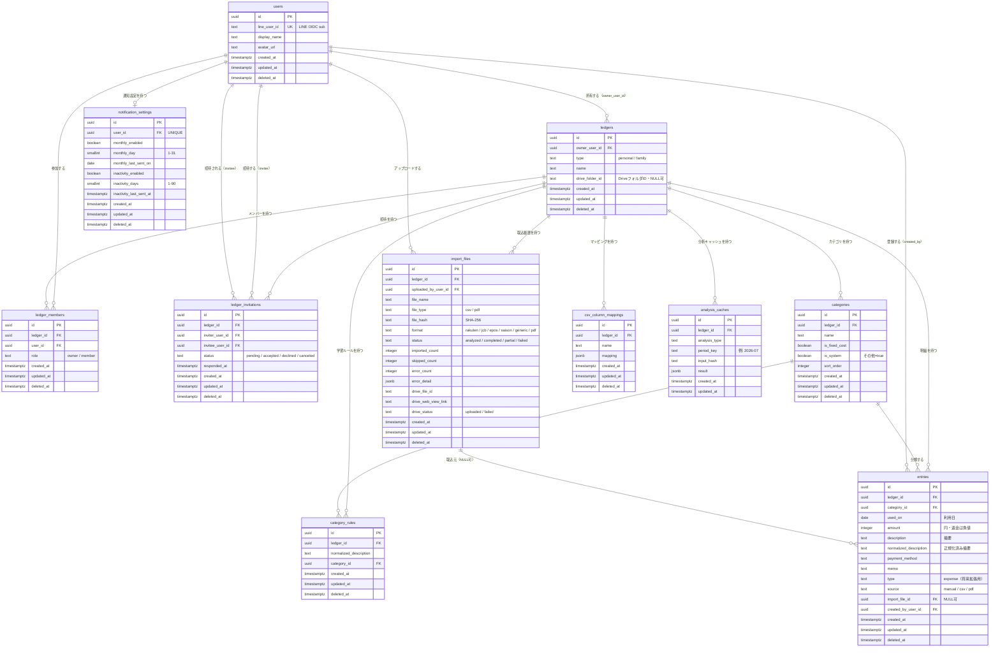

# ER図（er.md）

Tracking Money のER図です。

カラムの完全な定義・制約・Indexは docs/database.md を正とします。本書はリレーション把握用の全体図です。

---

# ER図（全体）

---

# 補足

* `analysis_caches` のみ論理削除（deleted_at）を持たない（派生データのため物理削除可・database.md 3.11）
* 「1ユーザーが所属できる家族家計簿は最大1つ」等、DB制約で表現しないルールは database.md 3.3 を参照

---

# 改訂履歴

| 日付 | 内容 |
| --- | --- |
| 2026-07-05 | 初版作成 |
| 2026-07-05 | レビュー指摘反映：ledgers に drive_folder_id を追加（FR-DRIVE-02） |
