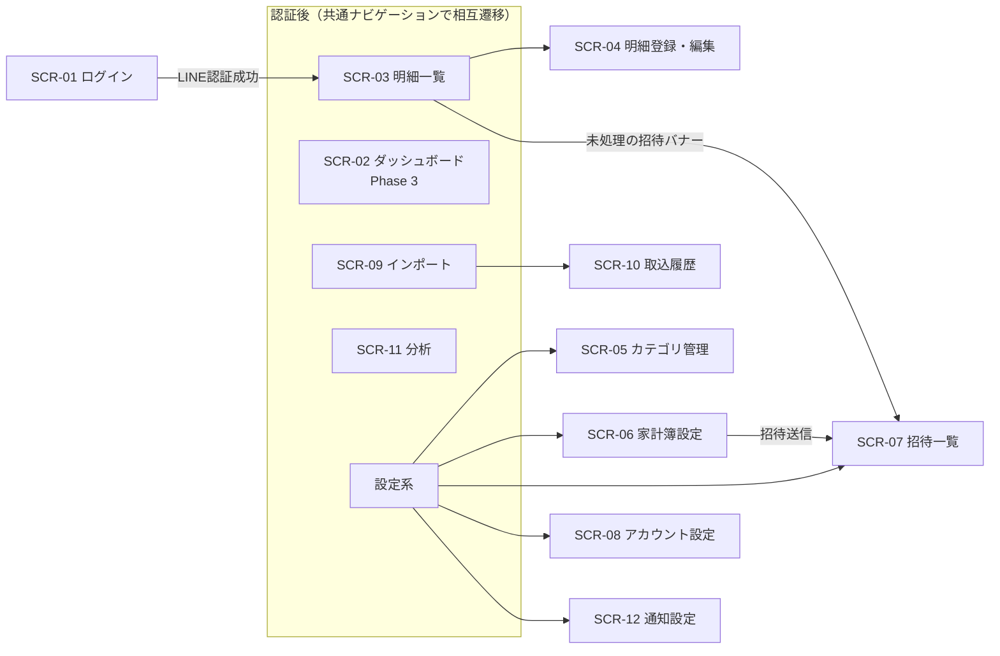

# 画面設計書（screen.md）

Tracking Money の画面設計・画面遷移定義書です。

要件は docs/requirements.md、APIは docs/api.md を正とします。UIの詳細規約は docs/ui-rules.md を参照してください。

---

# 1. 画面一覧

| ID | 画面名 | パス | Phase | 概要 |
| --- | --- | --- | --- | --- |
| SCR-01 | ログイン | `/login` | 1 | LINE Loginへの導線 |
| SCR-02 | ダッシュボード | `/dashboard` | 3 | 今月の支出サマリー（AI分析とあわせてPhase 3で導入） |
| SCR-03 | 明細一覧 | `/entries` | 1 | 明細の一覧・検索・絞り込み（**Phase 1のログイン後トップ**） |
| SCR-04 | 明細登録・編集 | （SCR-03内のモーダル） | 1 | 明細の手入力・編集 |
| SCR-05 | カテゴリ管理 | `/categories` | 1 | カテゴリの追加・編集・並び替え |
| SCR-06 | 家計簿設定 | `/ledger` | 1 | 名称変更・メンバー管理・招待 |
| SCR-07 | 招待一覧 | `/invitations` | 1 | 自分宛の招待の承諾・拒否 |
| SCR-08 | アカウント設定 | `/settings/profile` | 1 | 表示名変更・ログアウト |
| SCR-09 | インポート | `/import` | 2 | CSV/PDF取込ウィザード |
| SCR-10 | 取込履歴 | `/imports` | 2 | 取込履歴一覧・ファイル操作 |
| SCR-11 | 分析 | `/analysis` | 3 | AI分析・グラフ表示 |
| SCR-12 | 通知設定 | `/settings/notifications` | 3 | LINE通知のON/OFF・タイミング設定 |
| SCR-90 | エラー | `/error` ほか | 1 | 404 / 500 / 認証エラー |

---

# 2. 画面遷移図

* 未認証で認証後画面へアクセスした場合は SCR-01 へリダイレクトする（FR-AUTH-02）
* ログイン後のトップ着地は **Phase 1〜2 は明細一覧（SCR-03）**、**Phase 3 でダッシュボード（SCR-02）導入後は `/dashboard`** とする
* ログイン後、家計簿未作成の場合は個人家計簿の作成を促す（初回セットアップ）
* 未処理の招待バナーは Phase 1〜2 は明細一覧（SCR-03）、Phase 3 以降はダッシュボード（SCR-02）に表示する

---

# 3. 共通レイアウト

## 3.1 画面構成

| 領域 | PC（md以上） | スマートフォン |
| --- | --- | --- |
| ヘッダー | 上部固定：アプリ名／**帳簿切替**／アカウントメニュー | 上部固定：同左（簡略表示） |
| ナビゲーション | 左サイドバー | 下部ボトムナビ（ダッシュボード・明細・取込・分析・設定） |
| コンテンツ | 表形式を基本 | カード形式を基本 |

## 3.2 帳簿切替（FR-LEDGER-06 / FR-DASH-02）

* ヘッダーに現在の操作対象帳簿（個人／家族）を常時表示し、ドロップダウンで切替できる
* 切替状態は全画面（ダッシュボード・明細・取込・取込履歴・分析・カテゴリ・家計簿設定）へ共通に適用する
* 選択は `ActiveLedgerProvider`（`GET /api/ledgers` を1回取得）が保持し、`localStorage` に永続化して再訪時も維持する
* 保存済みの帳簿が存在しなくなった場合（削除・退出）は先頭の帳簿へ自動的にフォールバックする
* 帳簿が0件の場合は切替を表示せず、各画面が初期セットアップ導線を表示する
* 家族家計簿未参加の場合、SCR-06 に「家族家計簿を作成」導線を表示する

## 3.3 共通状態表示

| 状態 | 表示 |
| --- | --- |
| ローディング | スケルトン表示（スピナーの多用は避ける） |
| 0件 | 空状態イラスト＋次のアクション導線（例：「明細を登録する」「CSVを取り込む」） |
| APIエラー | インラインのエラーメッセージ＋再試行ボタン。エラーは握りつぶさない |
| AI失敗 | AI所見欄のみ「AI分析を取得できませんでした」表示。集計・グラフは表示継続（FR-AI-11） |
| 破壊的操作 | 確認ダイアログ必須（削除・メンバー除外・帳簿削除） |

---

# 4. 画面詳細

## SCR-01 ログイン

| 項目 | 内容 |
| --- | --- |
| 表示 | アプリ名・説明・「LINEでログイン」ボタン |
| 操作 | LINEでログイン → LINE認証 → 成功時 `/dashboard` へ |
| エラー | LINE認証失敗・キャンセル時はメッセージを表示して再試行可能にする |

## SCR-02 ダッシュボード（Phase 3）

使用API：`GET /api/ledgers/{id}/dashboard`

Phase 3 で導入する。導入後はログイン後のトップ着地を本画面へ切り替える。

| 項目 | 内容 |
| --- | --- |
| 表示 | 今月支出合計／前月比（増減額・%）／前年同月比／カテゴリ別内訳（円グラフ or 横棒）／直近明細（5件）／AI所見サマリー（SCR-11への導線） |
| 表示（共通） | 未処理の招待があればバナー表示 → SCR-07 |
| 操作 | 明細追加ボタン（SCR-04を開く）／各カテゴリタップで明細一覧（該当カテゴリ絞り込み）へ |

「今月」は支払月ベース。Asia/Tokyo の暦月をそのまま当月として扱う（`currentBillingMonth`。api.md 9章）。

## SCR-03 明細一覧

使用API：`GET /api/ledgers/{id}/entries`

| 項目 | 内容 |
| --- | --- |
| 表示（PC） | 表形式：利用日／支払月／摘要／カテゴリ／金額／支払方法／登録者（家族帳簿のみ）／支払者・按分方法バッジ（家族帳簿のみ・FR-SPLIT）／取込元アイコン |
| 表示（スマホ） | カード形式：日付見出しごとにグループ表示。カードに摘要・カテゴリ・金額（支払月が利用日と異なる場合のみ支払月も表示） |
| 絞り込み | 支払月切替（前月・翌月ナビ）／カテゴリ／金額範囲／キーワード／取込元。利用日の期間指定は併用可 |
| ソート | 利用日（既定：降順）／金額 |
| ページング | ページャ（PC）／さらに読み込む（スマホ） |
| 操作 | 行タップ→SCR-04（編集）／新規登録ボタン→SCR-04／スワイプまたはメニューから削除（確認ダイアログ） |
| 表示補足 | 返金（マイナス金額）は色を変えて表示する |
| 招待バナー | Phase 1〜2 は本画面をトップとするため、未処理の招待があればバナーを表示 → SCR-07（Phase 3 でダッシュボード導入後は SCR-02 が担当） |

## SCR-04 明細登録・編集（モーダル）

使用API：`POST / PATCH /api/ledgers/{id}/entries`

PCは中央モーダル、スマホはフルスクリーンモーダルとする。

| 入力項目 | 必須 | バリデーション |
| --- | --- | --- |
| 利用日 | ○ | 日付。既定は当日 |
| 支払月 | ○ | 年月。既定は利用日と同じ月（変更すると以後は利用日の変更に追従しない） |
| 金額 | ○ | 整数（マイナス可）。カンマ表示対応 |
| 摘要 | ○ | 1〜200文字 |
| カテゴリ | ○ | 帳簿のカテゴリから選択。既定は「その他」 |
| 支払方法 | − | 自由入力（過去入力値をサジェスト） |
| メモ | − | 500文字以内 |

* 編集でカテゴリを変更した場合、学習ルールが更新される旨は意識させない（バックグラウンド動作・FR-AICAT-03）
* バリデーションエラーは項目直下にインライン表示する

**家族家計簿のみ**（FR-SPLIT）、以下を追加表示する。個人家計簿では非表示。

| 入力項目 | 必須 | バリデーション |
| --- | --- | --- |
| 支払者 | ○ | 帳簿メンバーから選択。既定は自分（登録者） |
| 按分方法 | ○ | 「既定比重で按分」（既定値）／「この明細だけ独自の比重で按分」／「1人に全額計上」から選択 |
| 独自の比重 | 按分方法＝独自の比重のとき○ | メンバーごとに正の整数を入力（0以下は不可） |
| 計上先メンバー | 按分方法＝1人に全額計上のとき○ | 帳簿メンバーから選択 |

## SCR-05 カテゴリ管理

使用API：`GET / POST / PATCH / DELETE /api/ledgers/{id}/categories`、`PUT …/categories/order`

| 項目 | 内容 |
| --- | --- |
| 表示 | カテゴリ一覧（並び順どおり）。固定費フラグをバッジ表示。「その他」はシステムカテゴリ表示（削除・改名不可） |
| 操作 | 追加／名称・固定費フラグ編集／ドラッグ&ドロップ並び替え（スマホは上下ボタン）／削除 |
| 削除時 | 使用中明細の件数を表示し、付け替え先カテゴリを選択させる（既定：その他）（FR-CATEGORY-03） |

## SCR-06 家計簿設定

使用API：`GET / PATCH / DELETE /api/ledgers/{id}`、`GET / DELETE …/members`、`POST …/invitations`、`GET /api/users/search`、`PUT …/split/weights`

| 項目 | 内容 |
| --- | --- |
| 対象帳簿 | ヘッダーの帳簿切替（3.2）に従う。本画面には帳簿選択UIを持たない |
| 表示 | 帳簿名／type／メンバー一覧（家族帳簿のみ：表示名・role・参加日） |
| 操作（オーナー） | 帳簿名変更／メンバー除外（確認ダイアログ）／ユーザー検索→招待送信／帳簿削除（名称の再入力による確認） |
| 操作（メンバー） | 退出（確認ダイアログ） |
| 家族帳簿未作成時 | 「家族家計簿を作成」ボタンを表示。他の家族帳簿へ参加済みの場合は作成不可の理由を表示（FR-INVITE-04） |
| 既定按分比重（家族帳簿・オーナーのみ・FR-SPLIT-01/02） | メンバーごとに正の整数（比重）を入力。保存時に `PUT …/split/weights` を呼ぶ。メンバーが1名以下の間はこの項目自体を非表示（FR-SPLIT-08） |

## SCR-07 招待一覧

使用API：`GET /api/invitations`、`POST …/accept`、`POST …/decline`、`DELETE /api/invitations/{id}`

| 項目 | 内容 |
| --- | --- |
| 表示 | 受信タブ：招待者・帳簿名・状態／送信タブ（オーナー用）：相手・状態・取消ボタン |
| 操作 | 承諾／拒否 |
| 承諾時の分岐 | 自分の家族家計簿が既に存在する場合（409 FAMILY_LEDGER_EXISTS）、選択ダイアログを表示：「自分の家族家計簿を削除して参加」（帳簿名再確認つき）または「キャンセル」（FR-INVITE-03） |

## SCR-08 アカウント設定

使用API：`GET / PATCH /api/me`

| 項目 | 内容 |
| --- | --- |
| 表示 | アイコン・表示名・連携中のLINEアカウント表示 |
| 操作 | 表示名変更（1〜50文字）／ログアウト |

## SCR-09 インポート（ウィザード）

使用API：`POST …/imports/analyze`、`POST …/imports/{id}/confirm`、`GET / POST …/csv-mappings`

3ステップのウィザード形式。ステップインジケーターを常時表示する。
画面右上に「取込履歴を見る」リンクを置き、SCR-10 へはこの導線から遷移する（グローバルナビには置かない）。

### Step 1：ファイル選択

| 項目 | 内容 |
| --- | --- |
| 表示 | ドラッグ&ドロップ＋ファイル選択（CSV / PDF・最大10MB）／支払月選択（必須。この取込＝1回の請求書の対象月）／フォーマット選択（既定：自動判定） |
| 分岐 | 汎用CSVの場合：保存済みマッピング選択 or 新規マッピング作成（列の対応付けUI・サンプル行プレビュー付き） |
| エラー | 同一ファイル取込済み警告（DUPLICATE_FILE）→「それでも取り込む」で force 再実行／フォーマット判定不能→手動選択を促す |

### Step 2：プレビュー・確認（FR-CSV-04 / FR-CSV-08/09 / FR-PDF-02）

| 項目 | 内容 |
| --- | --- |
| 表示（PC） | 表形式：取込チェックボックス／利用日／支払月（編集可・既定はStep1の値）／摘要／金額／カテゴリ（編集可）／備考（編集可）／重複バッジ／（家族帳簿のみ・FR-SPLIT）支払者・按分方法（編集可・既定は支払者=取込実行者・按分方法=既定比重） |
| 表示（スマホ） | カード形式で同内容 |
| 重複候補 | 既存明細の内容を並べて表示。既定はチェックOFF（＝スキップ）（FR-DUP-02）。一括ON/OFF操作あり |
| カテゴリ | AI/ルール判定結果を初期値としてプルダウンで変更可（FR-AICAT-02）。判定元（AI/学習ルール）をアイコン表示 |
| エラー行 | 取込対象外として理由つきで別枠表示（FR-CSV-07） |
| 操作 | 「◯件を取り込む」で確定 → Step 3 |

### Step 3：結果

| 項目 | 内容 |
| --- | --- |
| 表示 | 取込件数・スキップ件数・エラー件数（FR-CSV-05）／Drive保存状態（失敗時は注意表示・FR-DRIVE-06） |
| 操作 | 「明細を見る」→ SCR-03（取込月へ）／「続けて取り込む」→ Step 1 |

## SCR-10 取込履歴

使用API：`GET …/imports`、`GET …/imports/{id}`、`GET …/{id}/download`、`DELETE …/{id}/file`

| 項目 | 内容 |
| --- | --- |
| 導線 | SCR-09（取込画面）の「取込履歴を見る」リンクから遷移する。URL（`/imports`）への直接アクセスも可 |
| 表示 | 取込日時／ファイル名／フォーマット／支払月／件数（取込・スキップ・エラー）／状態／Driveリンク（FR-DRIVE-05） |
| 操作 | ダウンロード／Driveファイル削除（確認ダイアログ。明細は残る旨を明示・FR-DRIVE-04）／詳細表示（エラー行の内容） |

## SCR-11 分析

使用API：`GET …/analysis/*`（summary / trend / ranking / subscriptions / insight）、`GET …/split/settlement`（精算タブのみ・FR-SPLIT）

タブ切替で各分析を表示する。集計・グラフは即時表示し、AI所見は遅延ロード（AI失敗時も集計は表示・FR-AI-11）。
すべて支払月基準で集計する（FR-ENTRY-08）。精算タブ以外の金額は按分機能の影響を受けず明細金額そのまま（FR-SPLIT）。

| タブ | 内容 |
| --- | --- |
| 月次サマリー | 今月支出・前月比・前年同月比／カテゴリ別内訳／AI所見（monthly_review） |
| 推移 | カテゴリ別の月次推移グラフ（12ヶ月既定・カテゴリ選択可） |
| ランキング | 期間内の支出金額順リスト |
| 固定費 | 固定費カテゴリの集計＋AI所見（fixed_cost） |
| サブスク | 検知されたサブスク候補一覧（月額・年間換算） |
| 提案・予測 | AI節約提案（saving_advice）／来月支出予測（forecast） |
| 精算（家族帳簿のみ・FR-SPLIT） | メンバーごとの按分後の本来の負担額／実際に支払った額／差額。差額を相殺する「誰が誰にいくら」の送金案。メンバーが1名以下の間は「メンバーが2名以上必要です」の空状態を表示（FR-SPLIT-08） |

* 月切替ナビを共通表示（精算タブも対象）
* AI所見には「再生成」ボタン（refresh=true）を配置。生成中はスケルトン表示
* 精算タブは家族家計簿のときのみタブ自体を表示する（個人家計簿では非表示）

## SCR-12 通知設定

使用API：`GET / PATCH /api/notification-settings`

| 項目 | 内容 |
| --- | --- |
| 表示・操作 | 月次リマインド：ON/OFF＋通知日（1〜31）／未登録リマインド：ON/OFF＋日数（1〜90） |
| 補足表示 | 通知はLINEへ送信される旨の説明 |

## SCR-90 エラー

| ケース | 表示 |
| --- | --- |
| 404 | 「ページが見つかりません」＋ダッシュボードへの導線 |
| 500 | 「エラーが発生しました」＋再読み込み導線（エラー詳細は表示せずログへ記録） |
| 認可エラー（403） | 「この家計簿へのアクセス権がありません」＋帳簿切替の案内 |

---

# 5. アクセシビリティ・レスポンシブ指針（要点）

詳細は docs/ui-rules.md に定めるが、画面設計上の必須事項を挙げる。

* すべての操作をキーボードのみで完結できること（モーダルのフォーカストラップ含む）
* グラフは色だけに依存せず、凡例・数値ラベルを併記する
* タップ領域は44px以上を確保する
* ブレークポイントは Tailwind 標準（`md` 未満をスマートフォンレイアウトとする）
* ダークモード対応（`prefers-color-scheme` 準拠＋手動切替）

---

# 改訂履歴

| 日付 | 内容 |
| --- | --- |
| 2026-07-05 | 初版作成 |
| 2026-07-05 | レビュー指摘反映：ダッシュボード（SCR-02）をPhase 3へ。Phase 1〜2のログイン後トップと招待バナーを明細一覧（SCR-03）へ変更 |
| 2026-07-21 | SCR-03の絞り込みを支払月基準へ変更、支払月列を追加。SCR-04に支払月入力を追加。SCR-09 Step1に支払月選択（必須）、Step2に支払月編集・備考入力を追加。SCR-11の集計基準が支払月であることを明記 |
| 2026-07-21 | SCR-10に支払月列を追加。SCR-02に「今月」の定義（毎月10日締め）を明記 |
| 2026-07-21 | 按分・精算（FR-SPLIT・家族家計簿限定）を実装。SCR-06に既定按分比重の編集、SCR-04に支払者・按分方法の入力、SCR-03に支払者・按分方法バッジ、SCR-11に「精算」タブを追加 |
| 2026-07-21 | SCR-09 Step2に行ごとの支払者・按分方法編集UIを追加（家族帳簿のみ。PC表・スマホカード両対応）。これでFR-SPLIT関連画面はすべて実装完了 |
| 2026-07-23 | 帳簿切替（3.2）をヘッダー常時表示の共通機能として実装し全画面へ適用（localStorage 永続化）。SCR-06 の帳簿選択UIを廃止。グローバルナビから「取込履歴」を削除し SCR-09 からの導線へ集約。SCR-02「今月」の定義を暦月ベースへ変更（10日締めを廃止） |
