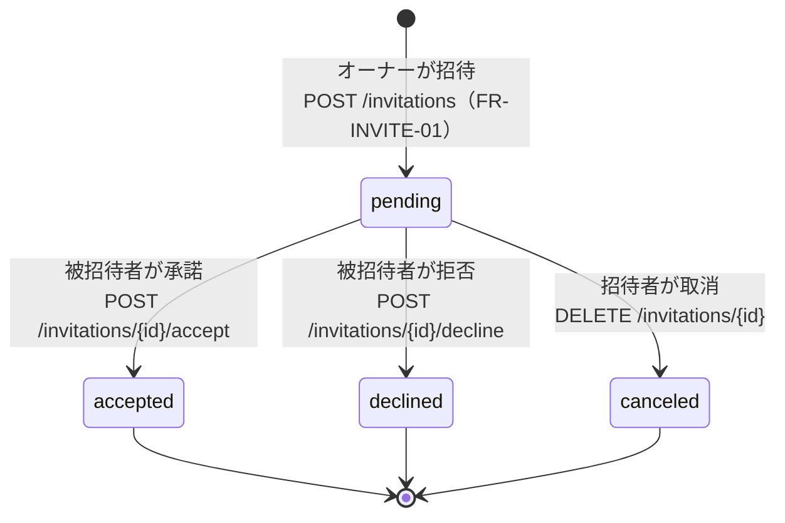
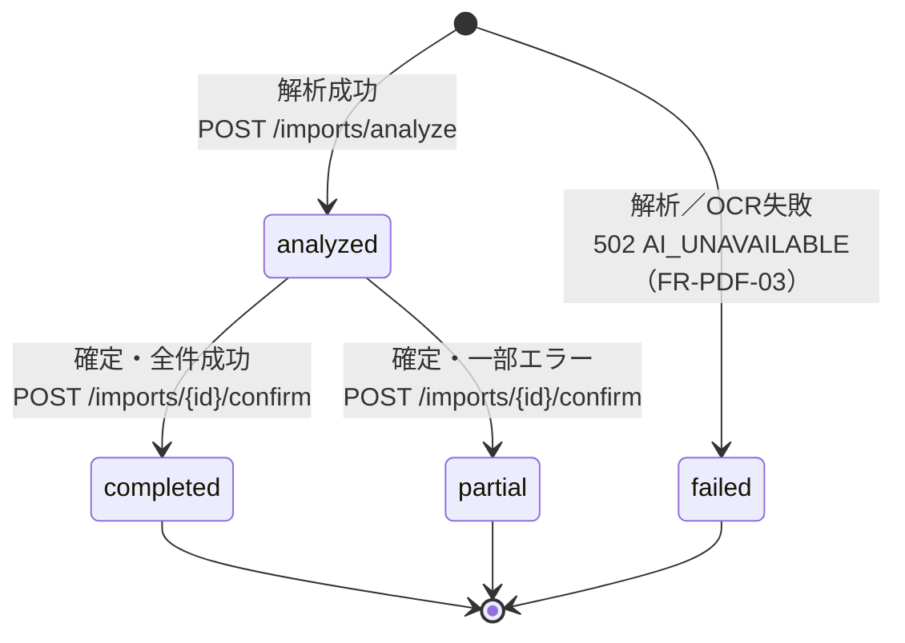
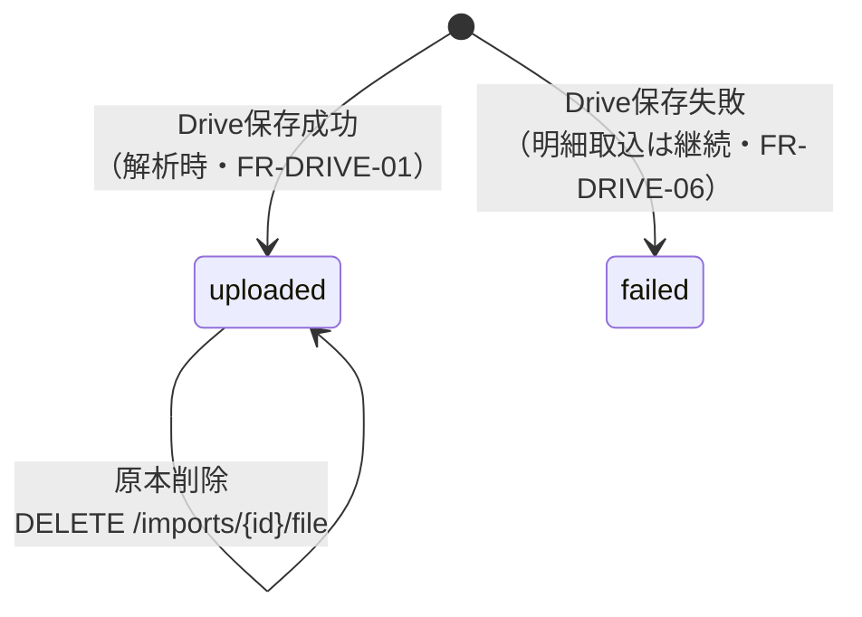
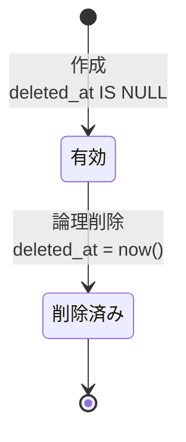
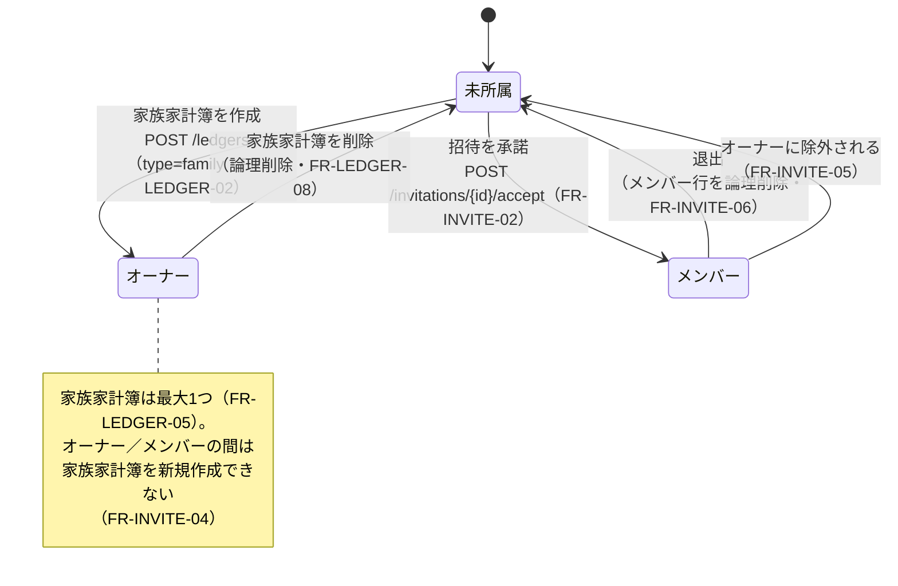

# 状態遷移図（state.md）

Tracking Money の主要エンティティの状態遷移図です。

状態値の正は docs/database.md（各テーブルの `status` / `deleted_at`）、遷移を起こす操作の正は docs/api.md、業務ルールの正は docs/requirements.md とします。仕様が競合する場合は requirements.md を最優先とします。

本書は「どの状態から、どの操作で、どの状態へ遷移できるか」を明確化し、不正遷移（未定義の状態変更）を防ぐことを目的とします。

---

# 1. 家族招待（ledger_invitations.status）

家族家計簿への招待の状態です（FR-INVITE-01〜04 / database.md 3.4）。

状態値：`pending` / `accepted` / `declined` / `canceled`

| 遷移 | 契機 | 副作用・制約 |
| --- | --- | --- |
| （なし）→ pending | オーナーが登録済みユーザーを招待 | 同一相手への pending 重複は不可（UNIQUE (ledger_id, invitee_user_id) WHERE status='pending'）。相手が既にメンバーなら 409 |
| pending → accepted | 被招待者が承諾 | `responded_at` を設定。`ledger_members` にメンバー行を作成（FR-INVITE-02）。被招待者が家族家計簿を**所有**している場合は 409 FAMILY_LEDGER_EXISTS を返し **状態は pending のまま**。`deleteOwnFamilyLedger=true` で再実行すると自帳簿を論理削除して accepted（FR-INVITE-03）。被招待者が**別の家族家計簿へメンバーとして参加済み**の場合は 409 ALREADY_FAMILY_MEMBER を返し pending のまま（自動退出せず、先に退出が必要・FR-LEDGER-05） |
| pending → declined | 被招待者が拒否 | `responded_at` を設定 |
| pending → canceled | 招待者が取消 | **pending のみ**取消可。応答済み（accepted/declined）は取消不可 |

* `accepted` / `declined` / `canceled` は終端状態で、以降の遷移は行わない。
* 終端状態から再度招待する場合は、新しい招待レコードを作成する（状態の巻き戻しはしない）。

---

# 2. 取込ファイル（import_files.status）

CSV / PDF 取込の状態です（FR-CSV-04〜05 / FR-PDF-01〜03 / database.md 3.7）。

状態値：`analyzed`（解析済・確定待ち） / `completed`（全件成功） / `partial`（一部エラー） / `failed`（解析失敗）

| 遷移 | 契機 | 副作用・制約 |
| --- | --- | --- |
| （なし）→ analyzed | 解析API成功 | フォーマット判定 → パース／OCR → カテゴリ判定 → 重複候補検知 → 原本を Drive 保存 の後、`analyzed` で作成（api.md 7.1）。この時点では明細は未登録（プレビュー待ち） |
| （なし）→ failed | 解析／OCR失敗 | `import_files` を `failed` で記録し 502 を返す。**AI失敗でアプリは異常動作させない**（FR-PDF-03） |
| analyzed → completed | 確定・全件成功 | 明細を登録。`imported_count` 等を記録。サーバー側で重複を再チェック（api.md 7.2） |
| analyzed → partial | 確定・一部行エラー | 成功分は登録し、エラー行は `error_detail` に記録（FR-CSV-07） |

* `analyzed` 以外への確定（confirm）は **409 CONFLICT**（多重確定の防止・api.md 7.2）。
* `completed` / `partial` / `failed` は終端状態。取込のやり直しは新しいファイルとして再取込する。
* `analyzed` のまま確定されない（プレビュー離脱）レコードは「確定待ち」として残る。原本の Drive 保存と重複判定は既に済んでいるため、再取込時は file_hash により取込済み警告の対象となる（FR-DUP-03）。

---

# 3. Drive 保存状態（import_files.drive_status）

取込原本の Google Drive 保存状態です（FR-DRIVE-01〜06 / database.md 3.7）。`status`（第2章）とは独立した軸で、取込処理の一部として確定します。

状態値：`uploaded` / `failed`

| 状態 | 意味 | 挙動 |
| --- | --- | --- |
| uploaded | 原本を Drive へ保存済み | ダウンロード可（api.md 7.5）。Drive リンクを表示（FR-DRIVE-05） |
| failed | Drive 保存に失敗 | **明細取込自体は成功させる**（FR-DRIVE-06）。ダウンロードは 404。ファイル未保存を履歴に表示 |

* Drive 保存の成否は取込（`status`）の成否を左右しない。保存失敗でも明細は登録される。
* 原本削除（DELETE /imports/{id}/file・FR-DRIVE-04）は Drive 上のファイルのみを削除し、`drive_file_id` / `drive_web_view_link` をクリアする。取込済み明細と履歴レコードは残る。`drive_status` の値自体は `uploaded` のまま（CHECK制約は uploaded/failed のみ）で、ファイル実体の有無は `drive_file_id` の NULL 判定で扱う。

---

# 4. 論理削除ライフサイクル（共通）

`deleted_at` を持つ全テーブル共通のライフサイクルです（database.md 1.1〜1.2）。対象：users / ledgers / ledger_members / ledger_invitations / categories / entries / import_files / csv_column_mappings / category_rules / notification_settings。

| 状態 | 定義 | 挙動 |
| --- | --- | --- |
| 有効 | `deleted_at IS NULL` | 通常クエリの対象。一意制約は部分ユニークインデックス（WHERE deleted_at IS NULL）で有効行のみに適用 |
| 削除済み | `deleted_at` に日時 | 通常クエリから必ず除外（database.md 1.2）。破壊的操作は削除前に確認ダイアログ必須（FR-LEDGER-08 / screen.md 3.3） |

* 復元（削除済み → 有効）は本フェーズでは提供しない。削除は一方向とする。
* **例外**：`analysis_caches` は派生データのため論理削除を持たず、物理削除（上書き・破棄）を許可する（database.md 3.11）。本ライフサイクルの対象外。
* カテゴリ削除時は、使用中の明細を「その他」（is_system）へ付け替えてから削除し、明細のカテゴリ欠損を発生させない（FR-CATEGORY-03）。

---

# 5. 家族家計簿への参加状態（ユーザー視点・導出状態）

第1章の招待状態と `ledger_members` から**導出される**、ユーザーの家族家計簿への関与状態です（単一カラムではなく複数テーブルからの論理状態）。「同時に紐づけられる家族家計簿は最大1つ」（FR-LEDGER-05）を保証する遷移を示します。

| 状態 | 定義 | 主な操作 |
| --- | --- | --- |
| 未所属 | 家族家計簿の owner でもメンバーでもない | 家族家計簿を作成／招待を承諾 |
| オーナー | type=family の家計簿を所有（role=owner） | 帳簿名変更／メンバー招待・除外／帳簿削除 |
| メンバー | 招待により参加（role=member） | 明細の参照・更新／退出 |

* 既に家族家計簿を持つユーザーが別の招待を承諾する場合は、409 FAMILY_LEDGER_EXISTS を経て、自帳簿を論理削除してから参加する（`deleteOwnFamilyLedger=true`・FR-INVITE-03）。第1章の pending → accepted と連動する。
* 個人家計簿（type=personal）は本状態機の対象外。ユーザーは個人家計簿を常に1つ持ち、共有・参加の概念を持たない。

---

# 6. 補足

* 本書の状態値は database.md の CHECK 制約と一致させること。状態値を追加・変更する場合は database.md → 本書の順で更新する。
* 状態を跨ぐ操作（承諾・確定・削除）は、実行前に現在の状態を検証し、不正遷移は 409 CONFLICT 等で拒否する（例：analyzed 以外への confirm、pending 以外への cancel）。
* 通知（notification_settings）は状態機ではなく設定値（ON/OFF・送信済み日時による連投防止）で制御するため、本書では扱わない（database.md 3.10）。

---

# 改訂履歴

| 日付 | 内容 |
| --- | --- |
| 2026-07-05 | 初版作成 |
| 2026-07-05 | レビュー指摘反映：招待承諾で「別の家族家計簿へ参加済み」の場合（409 ALREADY_FAMILY_MEMBER）を追記 |
